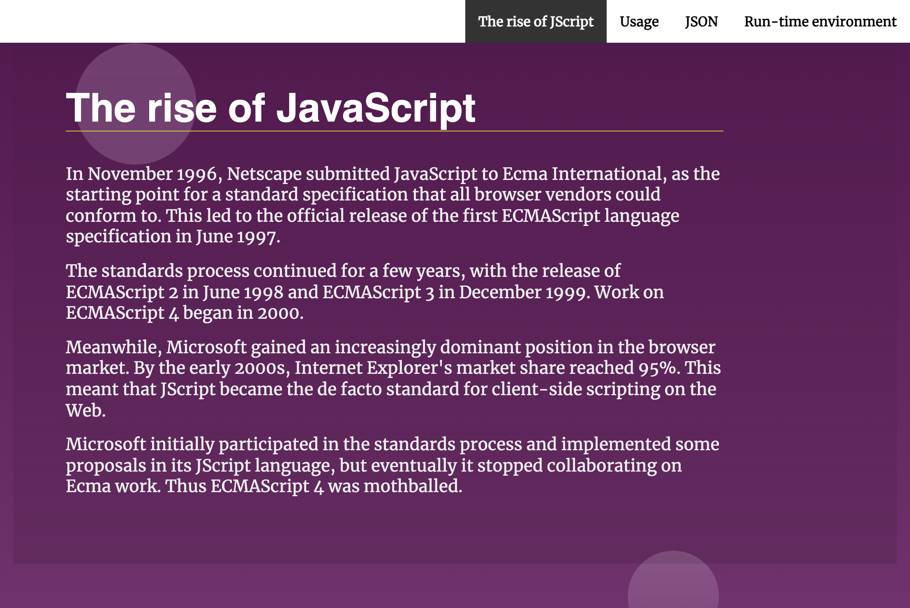

# Landing Page Project

## Table of Contents

* [Description](#description)
* [Usage](#usage)
* [Author](#author)

## Description

This project is about Javascript made by Mariya Al Mamariya, it demonstrate the use of getBoundingClientRect and scroll to element in the document and detect it's viewport visibility.

## Usage

To use this **Landing Page** click on the navigation menu sections to navigate between sections, each section is used to describe *the nature of javascript*.

## Author
This project is developed by Mariyah Al Mamariyah.